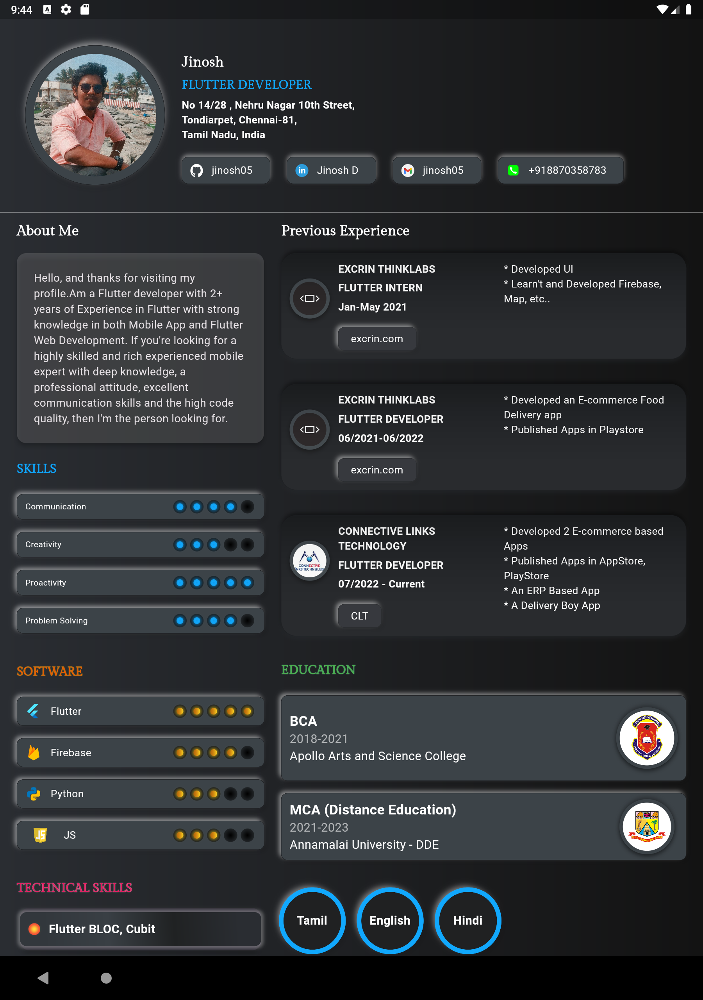
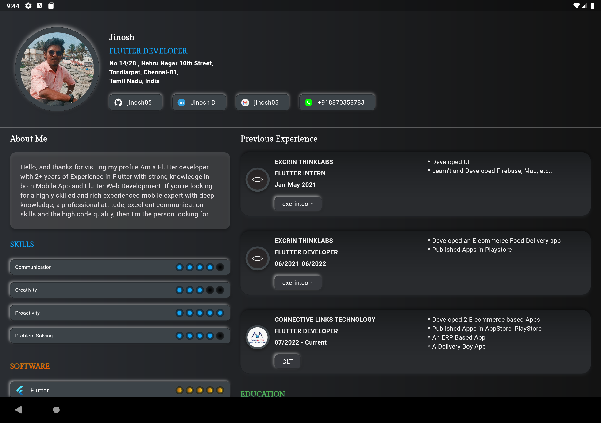

# Neumorphic CV 🚀

A sleek, professional, and responsive Neumorphic CV built with Pure Flutter. Show off your portfolio with a modern UI that works across Mobile, Tablet, and Web.

> [!TIP]
> **Neumorphism** (or soft UI) is a design trend that focuses on minimal, soft shadows and light to create a 3D effect on a 2D surface.

## ✨ Features

- 📱 **Fully Responsive**: Adapts seamlessly to Mobile, Tablet, and Desktop screens.
- 🎨 **Neumorphic Design**: Modern, premium "Soft UI" aesthetic.
- ⚙️ **Configurable**: Easily customize your info via `lib/env.dart`.
- 🔗 **Interactive**: Includes clickable social links and project buttons.
- ⚡ **High Performance**: Built with Flutter for smooth animations and transitions.

## 🛠️ Built With

- **Flutter**: The core framework.
- [**Flutter_Neumorphic**](https://github.com/jinosh05/Flutter-Neumorphic): Custom fork for advanced neumorphic components.
- [**Flutter_Svg**](https://pub.dev/packages/flutter_svg): For high-quality vector icons.
- [**Url Launcher**](https://pub.dev/packages/url_launcher): To handle external links and contact actions.

## 📸 Screenshots

### Mobile View
| Portrait | Landscape |
| :---: | :---: |
|  |  |

### Tablet View
| Portrait | Landscape |
| :---: | :---: |
|  |  |

## 🚀 Getting Started

### 1. Prerequisites
Ensure you have the [Flutter SDK](https://flutter.dev/docs/get-started/install) installed. This project currently supports **Flutter 3.10.x** and above.

### 2. Configuration
Personalize the CV by editing the `lib/env.dart` file. Replace the constants with your own information, project links, and experience details.

### 3. Running Locally
```bash
# Clone the repository
git clone https://github.com/jinosh05/Neumorphic-CV.git

# Navigate to project directory
cd Neumorphic-CV

# Get dependencies
flutter pub get

# Run the app
flutter run
```

### 4. Build for Web
```bash
flutter build web --release
```

### 5. Build for Android (APK)
```bash
flutter build apk --release
```
The output will be located in `build/app/outputs/flutter-apk/app-release.apk`.

## 🔑 License

This project is licensed under the MIT License - see the [LICENSE](LICENSE.md) file for details.

---
Built with ❤️ by [Jinosh D](https://github.com/jinosh05)
